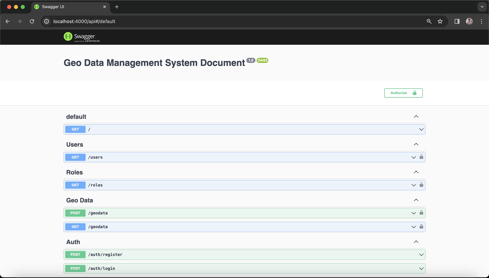

## Description

Project that is used to store geo data by uploading files and validating the format and content of geojson data.

This project is also supported with token-based authentication and role-based access authorization

## Setup

### 1. Installation

After cloning the project, make sure you have node v18^ and yarn installed.
Then you can run this command

```sh
# Install without updating lockfile
$ yarn install --frozen-lockfile
```

### 3. Development

- Make sure you have `.env.development.local` file. list of ENV variables needed:

```yml
APP_PORT=4000

DB_DATABASE=gdms
DB_HOST=localhost
DB_PORT=5432
DB_USER=postgres
DB_PASSWORD=123456
DB_SYNC=false # sets DB_SYNC to FALSE, Do not set it to TRUE on PRODUCTION mode
DB_LOGGING=error

SECRET_KEY=secret
LIFETIME=28800 # in seconds

```

## Setting Up DB

1. Make sure you have a postgres DB up and running
2. Set the DB env variables in `.env.development.local`
3. Run the migration script to initialize and update the database schema
   ```sh
   $ yarn migration:run
   ```
4. if successful, make sure the tables and `roles` data are initialized

## Run Application

```sh
# development
$ yarn start

# watch mode
$ yarn start:dev
```

## API Documentation

### Swagger URL

```
http://localhost:4000/api
```

### Swagger UI Screenshots



## Step by Step

There are 3 APIs that do not require token authority. On path `/` and `/auth/*`. So you can access them for free.

But other than that, all APIs require token data as validation of authorized users to access sensitive resources.

Here's a step by step to get a token data:

1. You should register data on the system by accessing the API `/auth/register`
2. After register successfully, you can log-in first to get a token data that will be used to access various APIs and resources.
3. Add the token to the API headers with the `Bearer token` type.
4. Finally, you already access the sensitive resources that you need.

## Format Conventions

Please configure your IDE to format your code based on the included `.prettierrc.json` `prettier` config file.
